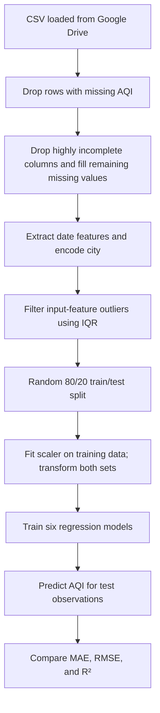

# Bangladesh Air Quality Prediction Using Machine Learning

## Overview

This student AI/ML portfolio project uses environmental measurements from Bangladesh to estimate Air Quality Index (AQI) with supervised machine learning regression. AQI estimates can help summarize air-quality conditions in a form that is easier to compare and monitor. The notebook compares six regression models using the same train/test split and reports MAE, RMSE, and R².

The current notebook predicts the AQI associated with each observation from that observation's pollutant and time/city features. It does not implement a future-horizon time-series forecasting setup.

## Project Highlights

- Processes a large dataset with **1,048,551 observations** and **13 columns**.
- Uses air-quality observations associated with Bangladesh.
- The notebook's cached overview reports **30 cities**.
- Extracts calendar features from observation timestamps and encodes city names.
- Compares six supervised regression models.
- Evaluates the models with MAE, RMSE, and R².
- The best recorded result is Extra Trees Regressor, with **MAE 6.825824**, **RMSE 10.739961**, and **R² 0.948026**.

## Dataset

The notebook loads a CSV using a Google Drive link and labels its source as “Mendeley Data / Google Drive CSV.” The repository does not include a dataset file or a more complete source citation. The original dataset's full time coverage is not established by the checked-in notebook outputs.

| Dataset detail | Value |
|---|---|
| Observations | 1,048,551 |
| Columns | 13 |
| Cities | 30, as reported by the notebook's cached output |
| Target | `aqi` |

`aqi` is already provided in the dataset and is used directly as the target. The notebook does not document how the original AQI values were calculated, so this project does not claim a particular AQI formula.

## Features

These are the inputs created and used in the notebook's model-training split. `aqi` is the target, not an input.

| Model feature | How it is represented |
|---|---|
| `city_name` | Integer-encoded city name |
| `pm10` | PM10 measurement |
| `pm2_5` | PM2.5 measurement |
| `carbon_monoxide` | Carbon monoxide measurement |
| `nitrogen_dioxide` | Nitrogen dioxide measurement |
| `sulphur_dioxide` | Sulphur dioxide measurement |
| `ozone` | Ozone measurement |
| `year` | Extracted from `datetime` |
| `month` | Extracted from `datetime` |
| `day` | Extracted from `datetime` |
| `hour` | Extracted from `datetime` |

**Target:** `aqi`

## Data Preprocessing

The notebook performs the following preprocessing before model fitting:

- Drops rows with missing `aqi` values.
- Drops columns with more than 50% missing values; the cached output identifies `carbon_dioxide`.
- Fills remaining numeric missing values with each column's median and categorical missing values with each column's mode.
- Removes `city_id`, `lat`, and `lon` from the modeling data.
- Parses `datetime`, extracts `year`, `month`, `day`, and `hour`, and removes the original timestamp column.
- Encodes `city_name` with scikit-learn's `LabelEncoder`.
- Filters outliers using IQR bounds on numeric input features, excluding `aqi`.
- Splits the data randomly into 80% training and 20% test sets (`random_state=42`).
- Fits `StandardScaler` on the training features and applies it to both training and test features.

The notebook's cached preprocessing output reports **893,517 rows × 12 columns** after preprocessing (11 inputs plus the target). The notebook computes imputation values, city encoding, and IQR thresholds before the train/test split; these cached results should therefore be interpreted in light of the existing workflow.

## Machine Learning Models

| Model | Implementation |
|---|---|
| Linear Regression | `LinearRegression` |
| Decision Tree Regressor | `DecisionTreeRegressor` |
| Random Forest Regressor | `RandomForestRegressor` |
| Extra Trees Regressor | `ExtraTreesRegressor` |
| Gradient Boosting Regressor | `GradientBoostingRegressor` |
| Histogram Gradient Boosting Regressor | `HistGradientBoostingRegressor` |

Each model is trained and evaluated using the same notebook split. MAE, RMSE, and R² are calculated from test-set predictions.

## Model Performance

The table below reproduces the **results recorded in the current notebook**. The notebook cells are not marked as executed in this repository, so these cached outputs are not presented as independently reproduced results.

| Model | MAE | RMSE | R² |
|---|---:|---:|---:|
| Extra Trees | 6.825824 | 10.739961 | 0.948026 |
| Random Forest | 7.123132 | 11.213441 | 0.943343 |
| Histogram Gradient Boosting | 9.497304 | 13.709427 | 0.915313 |
| Decision Tree | 9.249300 | 14.670368 | 0.903025 |
| Gradient Boosting | 10.903762 | 15.623494 | 0.890015 |
| Linear Regression | 15.431107 | 19.910052 | 0.821383 |

## Feature Importance

The notebook calculates feature importances for the fitted Extra Trees model. In its cached output, the strongest features are:

| Feature | Recorded importance |
|---|---:|
| `pm2_5` | 0.459662 |
| `pm10` | 0.253356 |
| `carbon_monoxide` | 0.075932 |

These are model-specific feature-importance scores from the notebook, not evidence of causal effects.

## Visualizations

The notebook generates visualizations for AQI distribution, feature importance, model comparison, and actual versus predicted AQI. These plots are currently available in the notebook and are not included as separate image files in the repository.

## Project Workflow



## Technologies Used

- Python
- Jupyter Notebook
- Pandas
- NumPy
- scikit-learn
- Matplotlib
- Seaborn

## Project Structure

```text
.
├── README.md
└── air_quality_forecasting.ipynb
```

## How to Run

1. Clone the repository:

   ```bash
   git clone https://github.com/ZilkarNayeen/Bangladesh-Air-Quality-Prediction-Using-Machine-Learning.git
   cd Bangladesh-Air-Quality-Prediction-Using-Machine-Learning
   ```

2. Install the notebook's Python dependencies. The repository does not currently include a `requirements.txt` file:

   ```bash
   python -m pip install pandas numpy scikit-learn matplotlib seaborn jupyter
   ```

3. Open the notebook:

   ```bash
   jupyter notebook air_quality_forecasting.ipynb
   ```

4. Run the notebook cells in order. Loading the dataset requires access to the Google Drive CSV link referenced in the notebook.

## Key Takeaways

This project demonstrates working with a large tabular dataset, handling missing data, creating date and categorical features, training supervised regression models, and comparing their results with MAE, RMSE, and R².

## Limitations

- The current implementation estimates AQI from pollutant measurements associated with the same observation; it does not evaluate a defined future prediction horizon.
- Performance figures are cached results in the existing notebook workflow and have not been independently reproduced here.
- Dataset provenance and the calculation method for the provided AQI values are not fully documented in the repository.
- The notebook uses a random split rather than a time-ordered evaluation, so the reported scores do not establish performance on later time periods.

## Future Improvements

- Add a time-aware evaluation protocol if the project is extended to forecasting or future-period generalization.
- Add visualizations to the repository and link them in this README.
- Explore hyperparameter tuning and sequential models such as LSTM or GRU as future experiments.

## Author

**Hossain Md Nayeen Zilkar** — [GitHub Profile](https://github.com/ZilkarNayeen)

## License

No license file is present in the repository. No license is specified here.
